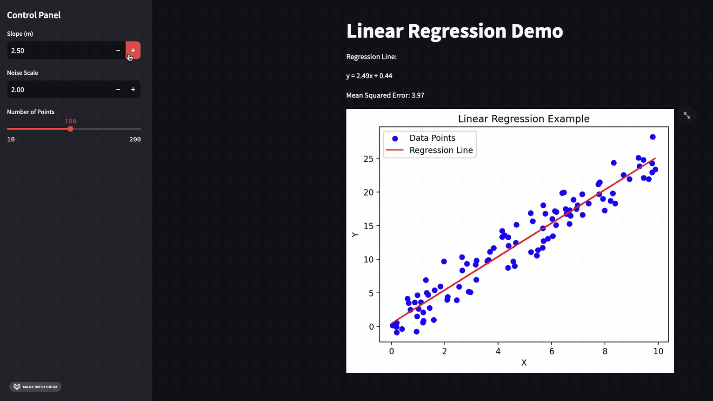

# AIoT-DA-2024 HW1

## 主題：Linear Regression

* 目標
    1. 產生隨機資料
    2. 顯示資料並標示出迴歸線
    3. 加入操作介面，讓使用者可以調整迴歸線的斜率、資料的散佈程度以及資料的數量

* 使用 chatgpt prompt
    1. Create a Python app that generates random data points, performs linear regression, and displays the regression line on a graph.
    2. And then use streamlit to make this app a web application
    3. And then add a control plane on the left hand side. I want to control the slope, noise and numbers of data.

* Demo
