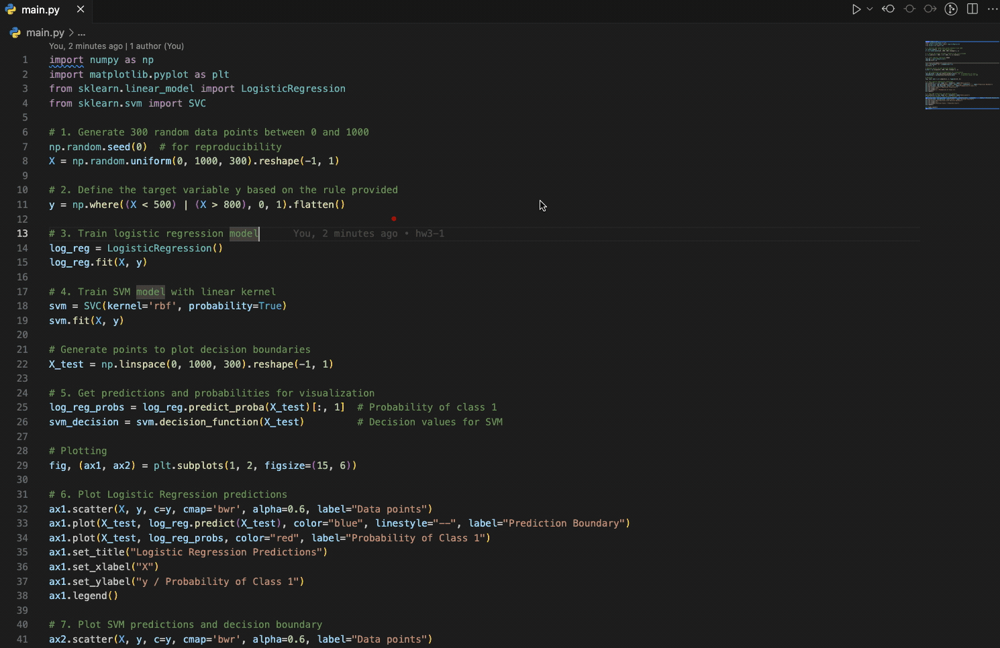

# HW3-1 SVM vs Logistic Regression

* This is a homework for the course "AIoT-DA", which is a comparison between SVM and Logistic Regression.
* This program is generated by ChatGPT.

## Demo



## Prompt

1. Raw Prompt

```plaintext
Write python to implement a system to perform logistic regression and SVM on a set of 300 randomly generated variables, and visualize the results. Here are some requirements:
1. 300 random data from 0 to 1000
2. use this formula to determine y: y=0 if x < 500 or y > 800 else y=1
3. demonstrate two plot for logistic regression and SVM predicating result and predicate boundary.
```

2. Generated Prompt

```plaintext
You’re a skilled Python developer with extensive experience in implementing machine learning algorithms, particularly logistic regression and support vector machines (SVM). You excel in generating synthetic datasets and visualizing the results of machine learning models to ensure clear understanding and presentation of data.

Your task is to write Python code that implements a system to perform logistic regression and SVM on a set of 300 randomly generated variables and visualize the results. 

Here are the details you need to keep in mind: 
1. Generate 300 random data points ranging from 0 to 1000.
2. Use the following formula to determine the target variable \( y \): \( y = 0 \) if \( x < 500 \) or \( x > 800 \) else \( y = 1 \).
3. Create two plots: one for logistic regression predictions and another for SVM predictions, including the decision boundaries.

Please provide the Python code for this task, ensuring that appropriate libraries such as NumPy, Matplotlib, and Scikit-learn are used for data handling and visualization.
```
