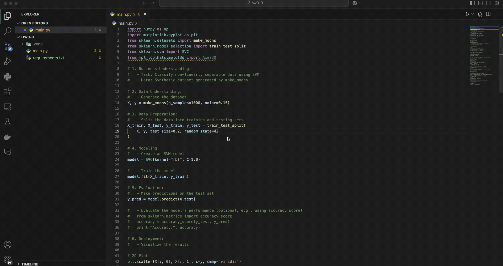

# HW3-3 2D SVM(non-circle)

* This is a homework for course "AIoT-DA", which is a 2D SVM demo for non-circle data.
* This program is made by Gemini

## Demo



## Prompt

1. Raw prompt

```plaintext
Write python to implement a system to perform SVM on the 1000 test dataset generate by make_moon method in sklearn, and visualize the results. Here are some requirements:
1. Use CRISP-DM
2. demonstrate the plot for SVM predicating result and predicate boundary.
3. demonstrate the 3D plot and hyperplane
```

2. Generated prompt

```plaintext
You’re a seasoned data scientist with extensive experience in implementing machine learning algorithms, particularly Support Vector Machines (SVM). You have a strong proficiency in Python and are well-versed in using libraries such as scikit-learn and Matplotlib for data visualization. Your goal is to create a robust Python script that not only implements SVM on a dataset but also visualizes the results effectively. 

Your task is to write a Python script that implements SVM on the 1000 test dataset generated by the make_moons method in scikit-learn and visualizes the results. 

Here are the specific requirements to keep in mind: 
1. Follow the CRISP-DM framework to ensure a structured approach.
2. Include a plot demonstrating the SVM predictions and the decision boundary.
3. Create a 3D plot to illustrate the hyperplane.

Make sure your script includes all necessary imports, dataset creation, model training, and visualization steps. Provide comments within the code to explain each section clearly.
```

3. Follow up for debugging

```plaintext
I got error:File "/Users/aaabin/Programing/project/AIoT-DA-2024-Hw/AIoT-DA-2024-Hw/hw3-3/main.py", line 89, in <module> ax.plot_surface(xx1, xx2, Z, alpha=0.3) File "/Users/aaabin/Programing/project/AIoT-DA-2024-Hw/AIoT-DA-2024-Hw/hw3-2/.venv/lib/python3.12/site-packages/mpl_toolkits/mplot3d/axes3d.py", line 1997, in plot_surface raise ValueError("Argument Z must be 2-dimensional.") ValueError: Argument Z must be 2-dimensional.
```